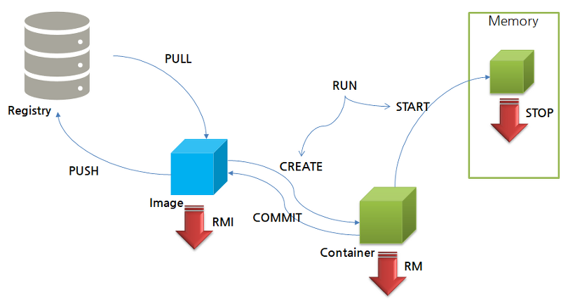

# Day 3

명령어 Run 은

pull 과 create, start 의 혼합 명령어이다.



- ps
- docker rm 컨테이너[id, name] : 컨테이터를 지우는 명령어 / 아이디의 경우 두글자정만 써도 겹치지 않으면 ok

- docker images
- docker rmi registry:tag / 이미지 아이디(2자리)

- docker info

docker root dir : 도커 

operating system : ubuntu 이다. 후에 컨테이너를 올려도 os를 올리는게 아니고 shell을 올리는것 vm과는 다름. 우분투 위에 도커가 있고 그위에 쉘프로그램이 있고 그위에 어플리케이션이 올라감. 쉘이 비에스로 올라감

루트폴더 들어가보면 sudo로 입력해야함. containers에 컨테이너, images에 이미지들, overlay2는 변화생길경우 저장

```bash
master@ubuntu:/var/lib/docker$ sudo du -sh ./
452K	./
master@ubuntu:/var/lib/docker$ sudo du -sh ./containers
4.0K	./containers
master@ubuntu:/var/lib/docker$ sudo du -sh ./image
228K	./image
master@ubuntu:/var/lib/docker$ sudo du -sh ./overlay2
8.0K	./overlay2

Docker default
```


### 이미지 검색

1. hub.docker.com
2. 명령어 (search) 로 검색

```bash
master@ubuntu:/var/lib/docker$ docker search ubuntu
NAME                                                      DESCRIPTION                                     STARS               OFFICIAL            AUTOMATED
ubuntu                                                    Ubuntu is a Debian-based Linux operating sys…   11314               [OK]                
dorowu/ubuntu-desktop-lxde-vnc                            Docker image to provide HTML5 VNC interface …   461                                     [OK]

# / 없는것은 기본 나머지는 개인이 만든것

$ docker search --filter=stars=300 ubuntu
#stars가 300개 이상인것 찾아줘

master@ubuntu:/var/lib/docker$ docker pull ubuntu:latest

master@ubuntu:/var/lib/docker$ sudo du -sh
80M	.
master@ubuntu:/var/lib/docker$ sudo du -sh ./containers
4.0K	./containers
master@ubuntu:/var/lib/docker$ sudo du -sh ./image
496K	./image
master@ubuntu:/var/lib/docker$ sudo du -sh ./overlay2
80M	./overlay2

# overlay2의 용량이 증가함 표준이미지는 굉장히 작음 overlay에 레이어를 쌓으면서 증가한다고보면됨

##[docker object의 저레벨수준 정보 출력]
$ docker inspect --help
$ docker inspect ubuntu


master@ubuntu:/var/lib/docker$ sudo ls -l image
total 4
drwx------ 5 root root 4096 Sep 15 03:33 overlay2
master@ubuntu:/var/lib/docker$ sudo ls -l image/overlay2
total 16
drwx------ 4 root root 4096 Sep  8 06:01 distribution
drwx------ 4 root root 4096 Sep  8 05:58 imagedb
drwx------ 5 root root 4096 Sep  8 06:01 layerdb
-rw------- 1 root root  274 Sep 15 03:33 repositories.json
master@ubuntu:/var/lib/docker$ sudo ls -l image/overlay2/imagedb
total 8
drwx------ 3 root root 4096 Sep  8 05:58 content
drwx------ 3 root root 4096 Sep  8 05:58 metadata
master@ubuntu:/var/lib/docker$ sudo ls -l image/overlay2/imagedb/content
total 4
drwx------ 2 root root 4096 Sep 15 03:33 sha256
master@ubuntu:/var/lib/docker$ sudo ls -l image/overlay2/imagedb/content/sha256
total 4
-rw------- 1 root root 3407 Sep 15 03:33 4e2eef94cd6b93dd4d794c18b45c763f72edc22858e0da5b6e63a4566a54c03c
## 

master@ubuntu:/var/lib/docker$ sudo ls -l image/overlay2/layerdb
total 12
drwxr-xr-x 2 root root 4096 Sep 15 03:14 mounts
drwxr-xr-x 6 root root 4096 Sep 15 03:43 sha256
drwxr-xr-x 2 root root 4096 Sep 15 03:43 tmp
master@ubuntu:/var/lib/docker$ sudo ls -l image/overlay2/layerd/sha256
ls: cannot access 'image/overlay2/layerd/sha256': No such file or directory
master@ubuntu:/var/lib/docker$ sudo ls -l image/overlay2/layerdb/sha256
total 16
drwx------ 2 root root 4096 Sep 15 03:43 160004bdd9a2800d0085be0315b769a9ce04c07ca175ecae89593eeee9aeb944
drwx------ 2 root root 4096 Sep 15 03:43 2ce3c188c38d7ad46d2df5e6af7e7aed846bc3321bdd89706d5262fefd6a3390
drwx------ 2 root root 4096 Sep 15 03:43 9ed638911072c3379e75d2eaf7c2502220d6757446325c8d96236410b0729268
drwx------ 2 root root 4096 Sep 15 03:43 ce7da152e578608030e9a05f9f5259b329fe5dcc5bf48b9f544e48bd69a5f630


master@ubuntu:/var/lib/docker$ sudo ls -l ./overlay2
total 20
drwx------ 4 root root 4096 Sep 15 03:43 25d2ab12bbf36e660b7e423ac91dc0ca3ba4ceb72368b9d6e3d0e72eeb73738d
drwx------ 3 root root 4096 Sep 15 03:43 2c54c7dd6ad7526016979702c119d08973dc9d237eb58897bebb1a411ccbc3ea
drwx------ 4 root root 4096 Sep 15 03:43 c2a2f74c8f18910ffe0335d97190ac0d6c0aef0556a2123008adceb4eb5b4ee1
drwx------ 4 root root 4096 Sep 15 03:43 d919b0e78145c9f76323a107451a5aea0834bf6e2b52aa03b8e232fae23974e1
drwx------ 2 root root 4096 Sep 15 03:43 l
master@ubuntu:/var/lib/docker$ sudo ls -l ./overlay2/l # 실제 layer에 대한 정보
total 16
lrwxrwxrwx 1 root root 72 Sep 15 03:43 752BLO25Y6AXOBOLQXKUS755SQ -> ../c2a2f74c8f18910ffe0335d97190ac0d6c0aef0556a2123008adceb4eb5b4ee1/diff
lrwxrwxrwx 1 root root 72 Sep 15 03:43 OMDSNFFKPUCKHFVWGTIHWRP5AB -> ../25d2ab12bbf36e660b7e423ac91dc0ca3ba4ceb72368b9d6e3d0e72eeb73738d/diff
lrwxrwxrwx 1 root root 72 Sep 15 03:43 UEZ7X42GUZS4SY4GLJA7PJUVC7 -> ../2c54c7dd6ad7526016979702c119d08973dc9d237eb58897bebb1a411ccbc3ea/diff
lrwxrwxrwx 1 root root 72 Sep 15 03:43 YQHEQRBMZ4VCUPHOSZ3QZSDLBX -> ../d919b0e78145c9f76323a107451a5aea0834bf6e2b52aa03b8e232fae23974e1/diff

$ sudo ls -R ./overlay2/l/"링크값"
$ sudo ls -l ./overlay2/"overlay2 값이 가르키고있는 데이터값"

# overlay2에 있는 폴더중 하나를 찾아보면
master@ubuntu:/var/lib/docker$ sudo ls -l ./overlay2/2c54c7dd6ad7526016979702c119d08973dc9d237eb58897bebb1a411ccbc3ea/diff
total 60
lrwxrwxrwx  1 root root    7 Jul 28 18:29 bin -> usr/bin
drwxr-xr-x  2 root root 4096 Apr 15 04:09 boot
drwxr-xr-x  2 root root 4096 Jul 28 18:33 dev
drwxr-xr-x 30 root root 4096 Jul 28 18:33 etc
drwxr-xr-x  2 root root 4096 Apr 15 04:09 home
lrwxrwxrwx  1 root root    7 Jul 28 18:29 lib -> usr/lib
lrwxrwxrwx  1 root root    9 Jul 28 18:29 lib32 -> usr/lib32
lrwxrwxrwx  1 root root    9 Jul 28 18:29 lib64 -> usr/lib64
lrwxrwxrwx  1 root root   10 Jul 28 18:29 libx32 -> usr/libx32
drwxr-xr-x  2 root root 4096 Jul 28 18:29 media
drwxr-xr-x  2 root root 4096 Jul 28 18:29 mnt
drwxr-xr-x  2 root root 4096 Jul 28 18:29 opt
drwxr-xr-x  2 root root 4096 Apr 15 04:09 proc
drwx------  2 root root 4096 Jul 28 18:33 root
drwxr-xr-x  4 root root 4096 Jul 28 18:29 run
lrwxrwxrwx  1 root root    8 Jul 28 18:29 sbin -> usr/sbin
drwxr-xr-x  2 root root 4096 Jul 28 18:29 srv
drwxr-xr-x  2 root root 4096 Apr 15 04:09 sys
drwxrwxrwt  2 root root 4096 Jul 28 18:33 tmp
drwxr-xr-x 13 root root 4096 Jul 28 18:29 usr
drwxr-xr-x 11 root root 4096 Jul 28 18:33 var
#이 안에서 실행된다고 생각하면됨
```


```bash
master@ubuntu:/var/lib/docker$ docker create -it ubuntu /bin/bash
== $ docker container create -it ubuntu /bin/bash
e36b70eee10f8026bde446412db605300986a4c83dd3b25fa18027f3b579a0fc
master@ubuntu:/var/lib/docker$ docker ps
CONTAINER ID        IMAGE               COMMAND             CREATED             STATUS              PORTS               NAMES
master@ubuntu:/var/lib/docker$ docker ps -a
CONTAINER ID        IMAGE               COMMAND             CREATED             STATUS              PORTS               NAMES
e36b70eee10f        ubuntu              "/bin/bash"         9 seconds ago       Created                                 exciting_gates


$ docker container --help
# 컨테이너만 관리하는 명령어

# 위의걸로 하나더만듬
master@ubuntu:/var/lib/docker$ sudo ls -l ./containers
total 8
drwx------ 3 root root 4096 Sep 15 04:14 591a8781e2b2622dc9d8b085662ce5cd2b69cdcea05b0a472b1f5a1f0a5f914f
drwx------ 3 root root 4096 Sep 15 04:10 e36b70eee10f8026bde446412db605300986a4c83dd3b25fa18027f3b579a0fc

master@ubuntu:/var/lib/docker$ sudo ls -l ./containers/e36b70eee10f8026bde446412db605300986a4c83dd3b25fa18027f3b579a0fc
total 12
drwx------ 2 root root 4096 Sep 15 04:10 checkpoints
-rw------- 1 root root 1771 Sep 15 04:10 config.v2.json
-rw-r--r-- 1 root root 1470 Sep 15 04:10 hostconfig.json

$ docker inspect [컨테이너 id 두자리]

```

```bash
master@ubuntu:/var/lib/docker$ docker start -i e3
root@e36b70eee10f:/# ls
bin  boot  dev  etc  home  lib  lib32  lib64  libx32  media  mnt  opt  proc  root  run  sbin  srv  sys  tmp  usr  var
root@e36b70eee10f:/# exit
exit
master@ubuntu:/var/lib/docker$ docker start e3
e3
master@ubuntu:/var/lib/docker$ docker stop e3

```

도커를 활용한 예

ubuntu + openJDK

openJDK

* JSP - Apache - Tomcat 을 까는 방법들 (선택은 커스터마이징의 문제)
  1. ubuntu + openJDK + Apache - Tomcat
  2. openJDK + Apache - Tomcat
  3. Apache - Tomcat  => 포트설정의 문제가 있음

```bash
master@ubuntu:~/docker$ docker run -it --name tomcat1 -p 8080:8080 openjdk:11-jre-slim /bin/bash

# apt-get update
# apt-get -y install tomcat9


root@20997a30f7fc:/# mkdir -p /usr/share/tomcat9
tomcat9/      tomcat9-root/ 
root@20997a30f7fc:/# mkdir -p /usr/share/tomcat9
tomcat9/      tomcat9-root/ 
root@20997a30f7fc:/# mkdir -p /usr/share/tomcat9
tomcat9/      tomcat9-root/ 
root@20997a30f7fc:/# mkdir -p /usr/share/tomcat9/
bin/                default.template    etc/                lib/                logrotate.template  
root@20997a30f7fc:/# mkdir -p /usr/share/tomcat9/conf
root@20997a30f7fc:/# mkdir -p /usr/share/tomcat9/common/classes
root@20997a30f7fc:/# mkdir -p /usr/share/tomcat9/server/classes
root@20997a30f7fc:/# mkdir -p /usr/share/tomcat9/shared/classes
root@20997a30f7fc:/# mkdir -p /usr/share/tomcat9/temp

/usr/share/tomcat9/bin/catalina.sh run
으로 톰캣 시작

# vm 내 firefox로 로컬호스트:8080 접속시 not found 확인가능.
root@db1c4ab01918:/# mkdir -p /usr/share/tomcat9/webapps/ROOT/WEB-INF
root@db1c4ab01918:/# vi /usr/share/tomcat9/webapps/ROOT/index.jsp
# 로 간단한 jsp 파일 제작


```

직접 홈페이지에서 받는다면

```bash
$ apt-get wget 으로 tar.gz 를 받아서하면댐
```

```bash
master@ubuntu:~/docker$ docker run -it -p 8001:8080 --name tomcat1 tomcat:8.5


master@ubuntu:~/docker$ docker run -it -d -p 8002:8080 --name tomcat2 tomcat:8.5
# 데몬으로 실행
```


